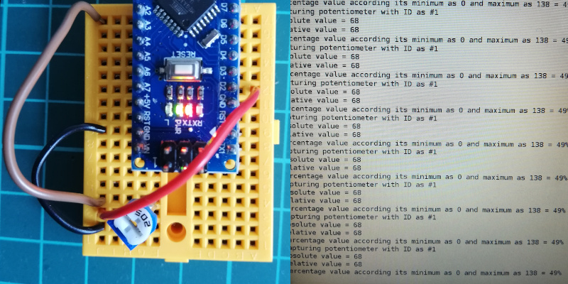

Arduino implementation for sensorlib
====================================

This directory contains the required files to convert the sensorlib library
into an Arduino library.

This directory files tree is as follows:
```
./arduino
├── example
│   └── potentiometer.ino
├── README.md
└── src
    └── sensor
        ├── library.properties
        └── sensorlib.h
```

## Install ##

The main source code directory of **sensor library** contains the class file 
Sensor.h. It is located at ./src/sensor starting at the root directory of this 
project.

Copy library.properties and sensorlib.h into the main **sensor library** directory.

And finally copy the main **sensor library** directory into your Arduino 
libraries path.

For example, for a Unix based operating system with the Arduino libraries path 
into $HOME/Arduino/libraries, it would be as follows:

```
git clone https://github.com/westial/sensorlib
cd sensorlib
cp arduino/src/sensor/* src/sensor/
cp -R src/sensor $HOME/Arduino/libraries/
```

## Example ##

An implementation of potentiometer as sensor is provided in ./arduino/example
directory. The picture bellow illustrates the circuit and shows an screenshot of
the serial monitor printing the results. 

The material used in this example is an Arduino Nano and a 5K potentiometer.

